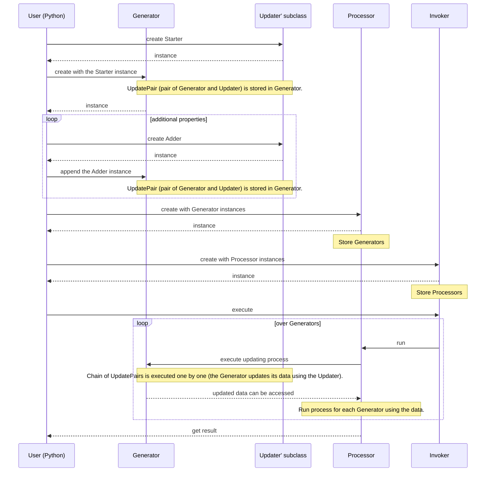

# ppap4lmp

PostProcess and Analysis Program for LAMMPS

## Installation

### via Conda

```bash
conda install -c irista56 ppap4lmp
```

### Development version

Just clone this repository and pip install.
Note that Eigen is required.

```bash
git clone --recursive https://github.com/irisTa56/ppap4lmp.git
cd ppap4lmp
pip install .
# (or) pip install -e .
# (or) pip install --user .
# (or) pip install --user -e .
```

Test your installation.

```bash
cd tests
tar xzvf archive.dumps_bead.tar.gz
tar xzvf archive.dumps_atom.tar.gz
python test.py
```

Tests can be conducted separately.

```bash
python test.py starter # filter, adder, processor
```

### Development version in Mac

#### If you prefer [Homebrew](https://brew.sh)

1. install dependencies

```bash
# install compiler and build tool
brew install gcc cmake
# install dependent libraries
brew install eigen pybind11
# install runtime dependency
brew install python; pip install numpy
```

2. get & build source

```bash
git clone --recursive https://github.com/irisTa56/ppap4lmp.git
cd ppap4lmp
export CXX=g++-8
pip install .
# (or) pip install -e .
# (or) pip install --user .
# (or) pip install --user -e .
```

3. run tests!

#### If you prefer Conda

1. install dependencies

```bash
conda install -c conda-forge \
  clangxx openmp cmake eigen pybind11 nlohmann_json numpy
```

2. get & build source; you do not need submodules

```bash
git clone https://github.com/irisTa56/ppap4lmp.git
cd ppap4lmp
export CXX=clang++  # Conda's clang++
export CXXFLAGS="-I/path/to/conda/include -L/path/to/conda/lib"
# (example) export CXXFLAGS="-I$HOME/miniconda3/include -L$HOME/miniconda3/lib"
pip install .
# (or) pip install -e .
# (or) pip install --user .
# (or) pip install --user -e .
```

3. run tests!

## Features

* Implemented by C++, Used from Python
* Data stored in Json structure
* Extensible without editing existing codes

## Sequence diagram



<br/>

* Actually, Generator stored as an item of UpdatePair is actually its subclass Element. An Element class instance has data (Json) as its member.
* Updater has some subclasses: Starter, Adder. Starter updates empty data (initializing data) and Adder updates non-empty data (adding new properties to existing data).

## Usage example

Coming soon...

## Acknowledgement

This project would not be possible without the following great open-source projects.

* [pybind/cmake_example](https://github.com/pybind/cmake_example)
* [pybind11](https://github.com/pybind/pybind11)
* [Eigen](http://eigen.tuxfamily.org/index.php?title=Main_Page)
* [nlohmann/json](https://github.com/nlohmann/json)
