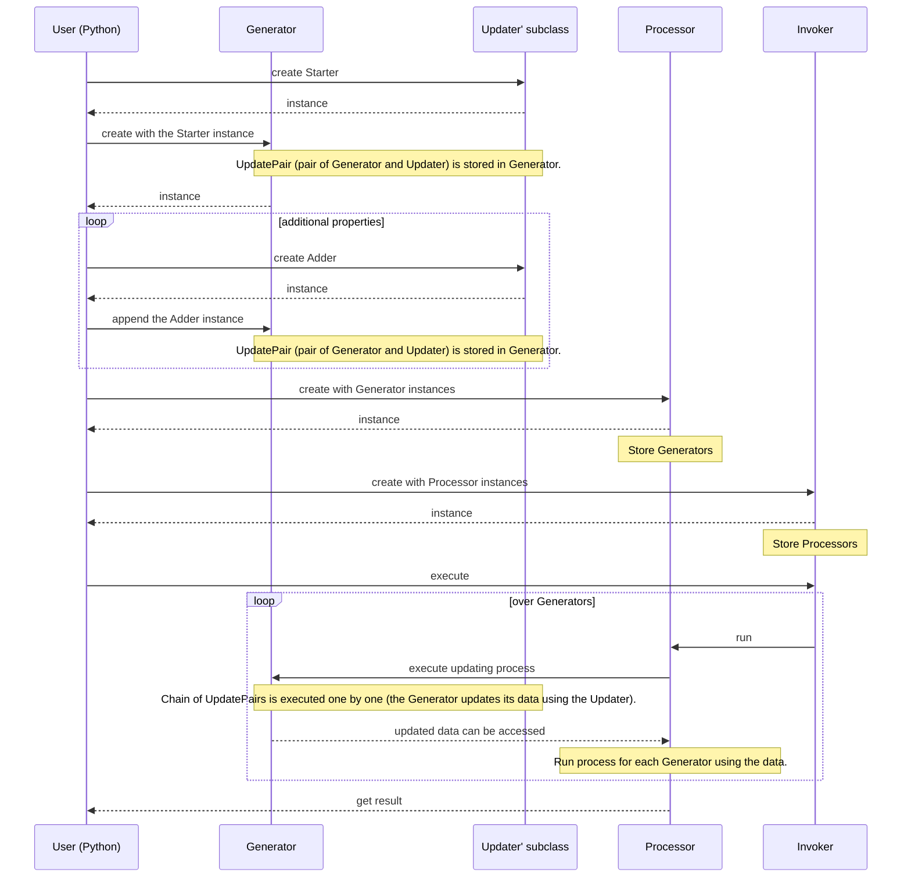

```mermaid
sequenceDiagram

  participant user as User (Python)
  participant gen as Generator
  participant upd as Updater' subclass
  participant pro as Processor
  participant inv as Invoker

  user ->> upd : create Starter
  upd -->> user : instance
  user ->> gen : create with the Starter instance

  note over gen,upd : UpdatePair (pair of Generator and Updater) is stored in Generator.

  gen -->> user : instance

  loop additional properties
    user ->> upd : create Adder
    upd -->> user : instance
    user ->> gen : append the Adder instance
    note over gen,upd : UpdatePair (pair of Generator and Updater) is stored in Generator.
  end


  user ->> pro : create with Generator instances
  pro -->> user : instance

  note over pro : Store Generators

  user ->> inv : create with Processor instances
  inv -->> user : instance

  note over inv : Store Processors

  user ->> inv : execute

  loop over Generators
    inv ->> pro : run
    pro ->> gen : execute updating process
    note over gen,upd : Chain of UpdatePairs is executed one by one (the Generator updates its data using the Updater).
    gen -->> pro : updated data can be accessed
    note over pro : Run process for each Generator using the data.
  end

  pro -->> user : get result
```